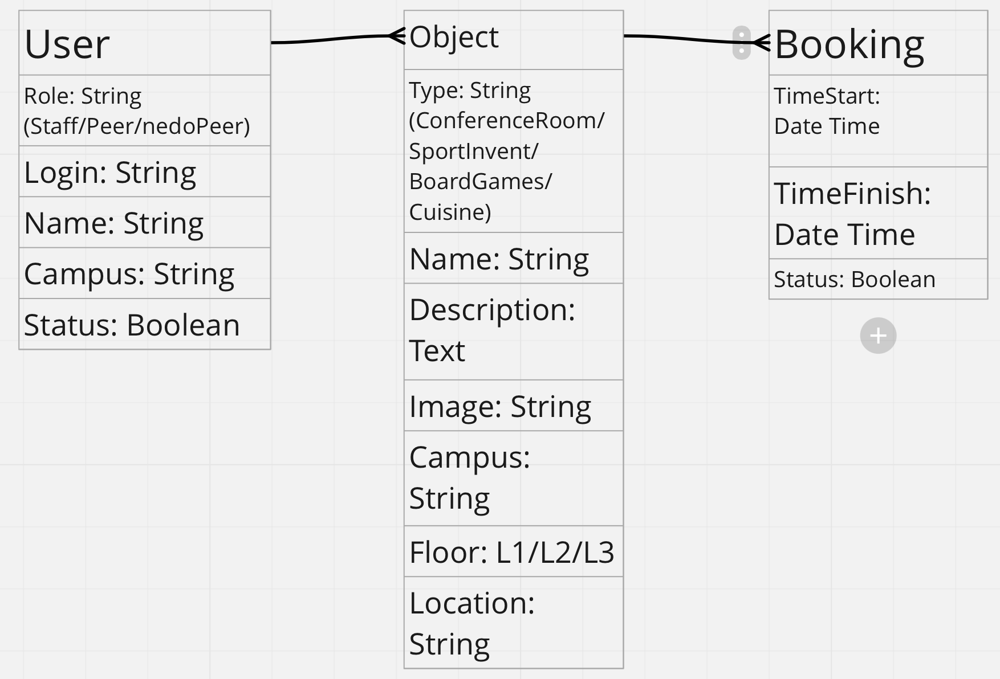

## Всего у нас с вами 3 базы данных

# База данных User

## Имеет 5 св-ва: Role, Login, Name, Campus и Status

Role имеет тип строки, ролей всего 3: Персонал, Студент, Абитуриент

Login тип строка, содержит ник платформы пользователя

Name тип строка, содержит имя пользователя

Campus тип строка, содержит название кампуса которому принадлежит пользователь

Status - тип Boolean, активный пользователь или нет, в плане: Персонал может быть был уволен или Студент отчислен и т.д.

# База данных Object

## Имеет 7 св-в: Type, Name, Description, Image, Campus, Floor, Location

Type тип строка, содержит тип объекта: Переговорка, Спорт инвентарь, Настольные игры, Кухня

Name тип строка, содержит название объекта

Description тип текст, содержит описание объекта

Image тип строка, содержит ссылку на изображение объекта

Campus тип строка, содержит наименование кампуса

Floor тип номер, содержит номер этажа в котором находится объект

Location тип строка, содержит наименование локации в которой находится объект

## База данных Booking

# Имеет 3 св-ва: TimeStart, TimeFinish, Status

TimeStart тип TimeDate, время и дата начала бронирования

TimeFinish тип TimeDate, время и дата окончания бронирования

Status тип Boolean, статус активности брони

# Связи между БД один ко многим начиная с Пользователей --> Объект --> Бронь
