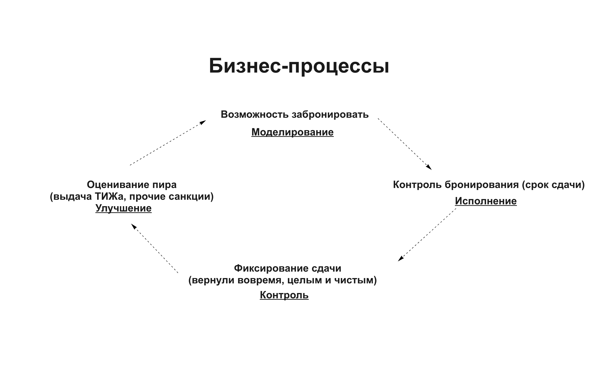

# Анализ предметной области
Предметная область нашего проекта -- собственность школы: помещения и инвентарь. Сущности конкретный или абстрактный объект, включая события и связи между объектами, информация о котором хранится и обрабатывается в базе данных. Следовательно, в нашем проекте сущностями являются то, что бронируется, тот, кто бронирует и сама бронь.

Ранее при использовании таблицы, которая служила способом забронировать что-либо, пользователи встречались с некоторыми проблемами: 

1. Сложно следить за бронью в большой и неудобной экселевской таблице, много времени тратится на поиск нужного предмета.
2. АДМ сложно отслеживать, кто последним использовал комнату или инвентарь.
3. Недоброжелательные пиры могут не отдавать инвентарь вовремя или не покидать бронируемое помещение. Редко они получают какие-либо санкции за это, в том числе потому что сложно отслеживать каждого (можно лишь дать тиж, но нельзя как-то отметить, что человек недобросовестно распоряжается, собственностью школы).
4. Пиру может быть сложно отслеживать день сдачи или он может просто забыть об этом.
5. АДМ может иметь проблемы с закупкой дорогого инвентаря, так как недобросовестные пиры могут их быстро испортить. И в случае такого события наказаны оказываются все пиры.
6. Абитуриенты не знакомы с системой школы, им сложно бронировать переговорки и они не всегда знают, что это вообще возможно.
7. Таблица с бронями находится в свободном пользовании и недобросовестный человек может испортить или подменить записи в свою пользу.
8. Пир может получить сломанный инвентарь или грязную комнату, либо сам все испортить и запачкать и сложно доказать чья была вина.
9. Сложность инвентаризации, если идет закупка или человек приносит вещь в дар, то АДМ нужно вручную заполнять и проставлять предметы в таблицу. Это отнимает время и есть возможность ошибиться.

Так что наши бизнес процессы нацелены на создание продукта, который улучшит опыт бронирования собственности школы. Мы проанализировали все эти проблемы и составили схему, которая демонстрирует новый и более совершенный порядок в бронировании. 

